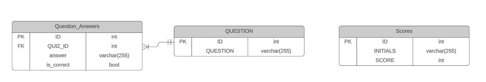

# Quiz-Application-with-Microservices

## General overview
Design and implement a quiz application, using a microservice architecture and various AWS services. This quiz application allows testing the user's knowledge about design patterns and refactorings. The application allows the user to select how many different questions (between one and ten) wants to answer. The application backend was written in python. The frontend was implemented using Javascript. Each question appear all by itself in the browser window. Once the user answers a question, the application give the user the corresponding feedback, indicating if the answer was right or wrong, and displays the correct answer if the user’s choice was wrong. After this, the user can proceed to see and answer the next question. Once all questions have been answered, the application displays the final score. Also, a score table with the initials and scores (in descending order) of all previous users is display. Finally, the user has an option to restart the quiz application.


## Instalation of dependencies required

 It is necessary to run the following commands in order to install the needed dependencies:

 ```
   pip install flask
   pip install flask-migrate
   pip install flask-sqlalchemy
   pip install mysqlclient
 ```
## To run the code
Must have the script **config.py** and run in a terminal: 

`python3 app.py`

## Url where hosted
http://54.242.238.228/

## Diagrams of the system


## Patterns used

## How to run the test suite
